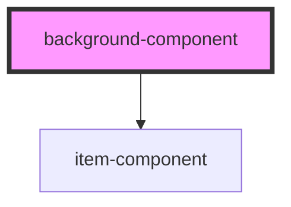

# background-component

<!-- Auto Generated Below -->

## Properties

| Property | Attribute | Description | Type  | Default     |
| -------- | --------- | ----------- | ----- | ----------- |
| `urls`   | `urls`    |             | `any` | `undefined` |

## Dependencies

### Depends on

- [item-component](../item-component)

### Graph

----------------------------------------------

*Built with [StencilJS](https://stenciljs.com/)*
