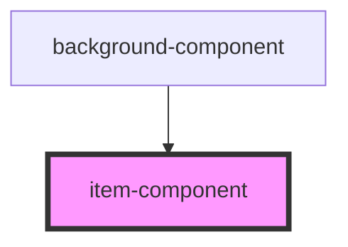

# item-component

<!-- Auto Generated Below -->

## Properties

| Property    | Attribute    | Description | Type     | Default     |
| ----------- | ------------ | ----------- | -------- | ----------- |
| `author`    | `author`     |             | `string` | `undefined` |
| `image`     | `image`      |             | `string` | `undefined` |
| `postTitle` | `post-title` |             | `string` | `undefined` |
| `ups`       | `ups`        |             | `string` | `undefined` |

## Dependencies

### Used by

 - [background-component](../background-component)

### Graph

----------------------------------------------

*Built with [StencilJS](https://stenciljs.com/)*
